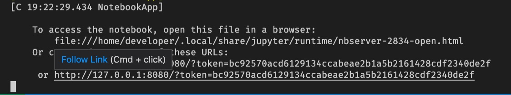
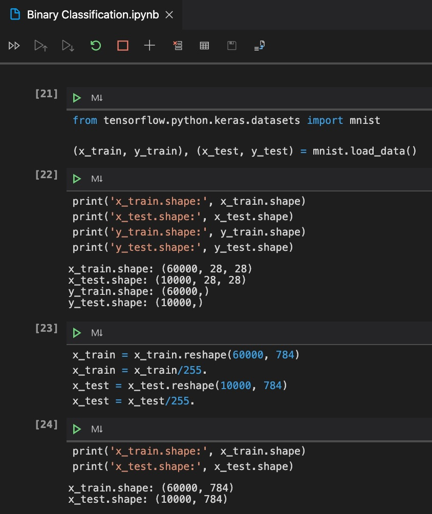
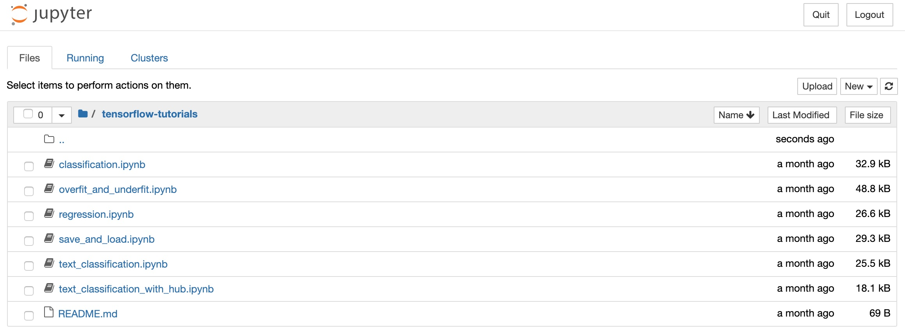
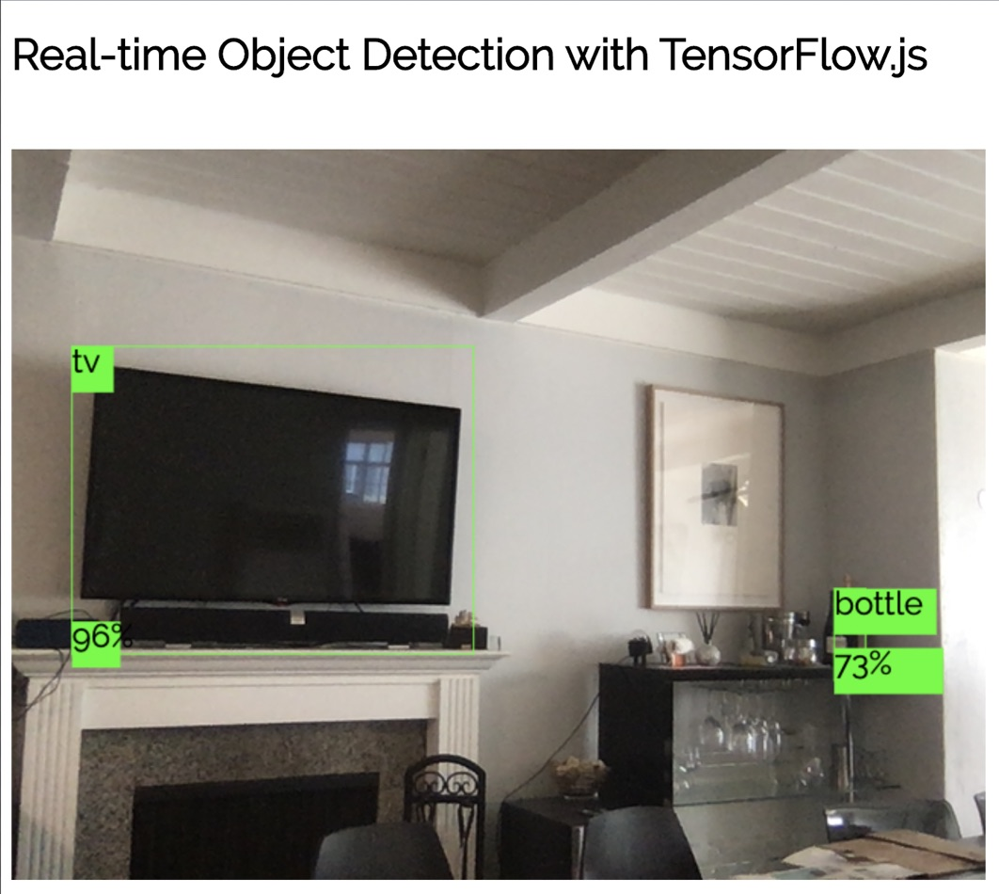

# TensorFlow

- [TensorFlow](#tensorflow)
  - [Summary](#summary)
  - [Using this definition with an existing folder](#using-this-definition-with-an-existing-folder)
  - [How it works](#how-it-works)
    - [Jupyter Notebook](#jupyter-notebook)
      - [Working with Jupyter Notebooks in Visual Studio Code](#working-with-jupyter-notebooks-in-visual-studio-code)
    - [Example NPM packages I choose here for root level](#example-npm-packages-i-choose-here-for-root-level)
    - [Sample project folders](#sample-project-folders)
      - [TensorFlow tutorials in Jupyter Notebook: `tensorflow-tutorials-jupyter`](#tensorflow-tutorials-in-jupyter-notebook-tensorflow-tutorials-jupyter)
      - [Real-time Object Detection with TensorFlow.js: `sample-app-es6`](#real-time-object-detection-with-tensorflowjs-sample-app-es6)
  - [License](#license)

## Summary

*Develop machine learning applications in TensorFlow. Includes TensorFlow, Jupyter Notebook, TensorFlow.js.*

| Metadata | Value |
|----------|-------|
| *Contributors* | [@yamaryu0508](https://twitter.com/yamaryu0508) |
| *Definition type* | Dockerfile |
| *Languages, platforms* | TensorFlow, TensorFlow.js, Jupyter Notebook, Python, JavaScript, Node.js |

## Using this definition with an existing folder

Just follow these steps:

1. If this is your first time using a development container, please follow the [getting started steps](https://aka.ms/vscode-remote/containers/getting-started) to set up your machine.

2. To use VS Code's copy of this definition:
   1. Start VS Code and open your project folder.
   2. Press <kbd>F1</kbd> select and **Remote-Containers: Add Development Container Configuration Files...** from the command palette.
   3. Select the Dart definition.

3. To use latest-and-greatest copy of this definition from the repository:
   1. Clone this repository.
   2. Copy the contents of `vscode-dev-containers/tensorflow/.devcontainer` to the root of your project folder.
   3. Start VS Code and open your project folder.

4. After following step 2 or 3, the contents of the `.devcontainer` folder in your project can be adapted to meet your needs.

5. Finally, press <kbd>F1</kbd> and run **Remote-Containers: Reopen Folder in Container** to start using the definition.

## How it works

### Jupyter Notebook
Run Jupyter Notebook as bellow.
```:shell
jupyter notebook --ip=0.0.0.0 --port=8080
```

When Jupyter Notebook is started, the link to access the notebook is shown like this.



In this case, we can access the notebook with `http://127.0.0.1:8080/?token=bc92570acd6129134ccabeae2b1a5b2161428cdf2340de2f` from the browsers.

#### Working with Jupyter Notebooks in Visual Studio Code
On the other hand, Visual Studio Code supports working with Jupyter Notebooks natively ([Learn more](https://code.visualstudio.com/docs/python/jupyter-support)). So we can run `*.ipynb` files without starting `jupyter notebook` from the command.



### Example NPM packages I choose here for root level
They allow us to handle `ES6+`.

```:json
{
  "dependencies": {
    "@tensorflow/tfjs": "^1.7.1",
    "@tensorflow/tfjs-vis": "^1.4.0"
  },
  "devDependencies": {
    "@babel/core": "^7.9.0",
    "@babel/preset-env": "^7.9.0",
    "babel-loader": "^8.1.0",
    "core-js": "^3.6.4",
    "regenerator-runtime": "^0.13.5",
    "webpack": "^4.42.1",
    "webpack-cli": "^3.3.11",
    "webpack-dev-server": "^3.10.3"
  }
}
```
### Sample project folders

#### TensorFlow tutorials in Jupyter Notebook: `tensorflow-tutorials-jupyter`
They are originally included in Docker image `tensorflow/tensorflow:nightly-gpu-py3-jupyter`.



#### Real-time Object Detection with TensorFlow.js: `sample-app-es6`
```:shell
sample-app-es6
├── public
│   └── index.html
├── src
│   └── index.js
└── webpack.config.js
```

Use [`webpack-dev-server`](https://webpack.js.org/configuration/dev-server/) when you start developing this sample app.

```:shell
$(npm bin)/webpack-dev-server --watch
```



## License

Copyright (c) Ryu Yamashita. All rights reserved.

Licensed under the MIT License.
